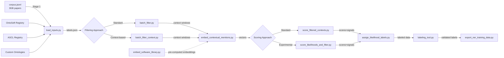

# Entity Extractor

**Elevator pitch**: Automatically identify software mentions in scientific papers at scale to improve reproducibility and enable software impact analysis.

## What & Why

### Problem Statement
Reproducibility in science depends on knowing _which software_ a paper used. Unfortunately, PDF text seldom marks software explicitly, and manual identification is impossible at scale. This project recovers software mentions from millions of academic papers using advanced NLP techniques.

### Scientific Impact
- **Enrich ADS metadata** → enables faceted search by software tools
- **Build training datasets** for domain-specific NER models  
- **Support bibliometrics** of software usage and citation patterns
- **Enable reproducible research** by tracking computational dependencies

### Target Scope
- **Primary corpus**: ~10M astrophysics papers from ADS (Astrophysics Data System)
- **Generalizable**: Works with any JSONL corpus containing `{bibcode, title, abstract, body}` fields
- **Software registries**: OntoSoft, ASCL (Astrophysics Source Code Library), and custom ontologies

## 10-Minute Quick Start

For newcomers who want instant success without downloading 3GB corpus:

```bash
# 1. Setup environment
git clone https://github.com/adsabs/entity_extractor
cd entity_extractor
python -m venv venv && source venv/bin/activate

# 2. Install dependencies
pip install -r software_mentions_pipeline/requirements.txt

# 3. Run with sample data
python software_mentions_pipeline/load_inputs.py --sample
python streamlit_dashboard/launch_app.py
```

Open `http://localhost:8501` for an interactive interface with sample data included.

## 📁 Repository Map

<details>
<summary><strong>software_mentions_pipeline/</strong> - Core extraction pipeline (8+ stages)</summary>

- **load_inputs.py** - Initialize database and load corpus/metadata
- **batch_filter.py** - Stage 1: Extract exact/fuzzy matches from text
- **batch_filter_context.py** - Alternative: Context-level fuzzy filtering
- **embed_contextual_mentions.py** - Generate sentence embeddings for contexts
- **embed_software_library.py** - Pre-compute embeddings for software registries
- **score_filtered_contexts.py** - Score context similarity using multiple signals
- **score_likelihoods_and_filter.py** - Alternative: Experimental scoring approach
- **assign_likelihood_labels.py** - Assign final likelihood classifications
- **labeling_tool.py** - Manual annotation interface for quality assurance
- **export_ner_training_data.py** - Export labeled data for model training
- **data/** - SQLite database, corpus files, and intermediate outputs
</details>

<details>
<summary><strong>ontologies/</strong> - Software registry data and management</summary>

- Raw JSON registries (OntoSoft, ASCL) with software metadata
- Helper scripts for registry updates and cleaning
- Embedding precomputation for software descriptions
</details>

<details>
<summary><strong>streamlit_dashboard/</strong> - Interactive experimentation UI</summary>

- **app.py** - Main Streamlit application with real-time pipeline execution
- **components/** - Modular UI widgets for entity input, parameter tuning, results display
- **core_pipeline/** - Pipeline wrappers optimized for interactive use
- **sample_data/** - Ready-to-use test dataset for immediate experimentation
</details>

<details>
<summary><strong>scripts/</strong> - Utility and maintenance tools</summary>

- One-off data processing and analysis utilities
- Registry update and validation scripts
- Performance benchmarking and optimization helpers
</details>

**optimized_extractor/** - Experimental fast Cython/regex prototype (WIP)  
**streamlit_dashboard/** - Web UI for quick experimentation and parameter tuning  
**AGENT.md** - Development environment configuration and commands</details>

## Quick Start

## Project Bootstrap Checklist
Note: If running this on scixmuse the virtual environment has already been created and so you just need to cd to entity_extractor, type source venv/bin/activate, then cd to streamlit_dashboard and type streamlit run app.py
```bash
# 1. Environment setup
python -m venv venv && source venv/bin/activate
pip install --upgrade pip setuptools wheel

# 2. Install dependencies
pip install -r software_mentions_pipeline/requirements.txt

# 3. Install development tools (optional but recommended)
pip install black isort flake8 mypy pytest pre-commit

# 4. Setup pre-commit hooks (optional)
pre-commit install

# 5. Test installation
python software_mentions_pipeline/test_indus_ner_tags.py
```

## Build/Test Commands

### Environment Management
- `source venv/bin/activate` - Activate virtual environment (ALWAYS FIRST)
- `pip install -r software_mentions_pipeline/requirements.txt` - Install dependencies
- `pip list | grep -E "(transformers|sentence-transformers|streamlit)"` - Verify key packages

### Testing & Validation
- `python software_mentions_pipeline/test_indus_ner_tags.py` - Test NER model functionality
- `pytest software_mentions_pipeline/tests/` - Run unit tests (if available)
- `python -c "import transformers; print('✓ Transformers OK')"` - Quick dependency check

### Pipeline Execution (Sequential Stages)
1. `python software_mentions_pipeline/load_inputs.py` - Initialize database and load corpus/metadata
2. `python software_mentions_pipeline/batch_filter.py` - Stage 1: Extract exact/fuzzy matches
   - *Alternative*: `batch_filter_context.py` - Context-level filtering approach
3. `python software_mentions_pipeline/embed_contextual_mentions.py` - Generate embeddings for contexts
   - *Optional*: `embed_software_library.py` - Pre-compute registry embeddings
4. `python software_mentions_pipeline/score_filtered_contexts.py` - Score context similarity
   - *Alternative*: `score_likelihoods_and_filter.py` - Experimental scoring
5. `python software_mentions_pipeline/assign_likelihood_labels.py` - Assign likelihood scores
6. `python software_mentions_pipeline/labeling_tool.py` - Manual labeling interface
7. `python software_mentions_pipeline/export_ner_training_data.py` - Export training data

### Dashboard & Interactive Tools
- `streamlit run streamlit_dashboard/app.py` - Launch streamlit dashboard

## Architecture

Entity extraction pipeline for scientific literature using NLP and ML:
- **software_mentions_pipeline/**: Main pipeline for extracting software mentions from academic papers
- **data/**: Contains corpus.jsonl (3GB papers), metadata (OntoSoft, ASCL), SQLite database
- **Database**: SQLite with `candidates` table storing matches, contexts, embeddings, classifications
- **Models**: INDUS NER (adsabs/nasa-smd-ibm-v0.1_NER_DEAL), sentence-transformers for embeddings

## 🔄 Pipeline Architecture & Data Flow



### Stage-by-Stage Process

1. **Data Loading** (`load_inputs.py`)
   - Initialize SQLite database with optimized schema
   - Load software registries (OntoSoft, ASCL, custom) 
   - Parse and index paper corpus for efficient querying

2. **Exact Matching** (`batch_filter.py`)
   - Find exact software name matches in paper text
   - Extract surrounding context windows (±100 words)
   - Store candidate matches with metadata (section, position, bibcode)

3. **Context Embedding** (`embed_contextual_mentions.py`)
   - Generate sentence embeddings using NASA's domain-adapted model
   - Batch process contexts for GPU efficiency
   - Store vectors in SQLite for similarity computation

4. **Multi-Signal Scoring** (`score_filtered_contexts.py`)
   - **Semantic similarity**: Context-to-description embedding cosine similarity
   - **Keyword heuristics**: Presence of software-related terms (algorithm, model, code, etc.)
   - **NER signals**: Domain-specific named entity recognition confidence
   - **Position signals**: Title/abstract mentions weighted higher

5. **Classification** (`assign_likelihood_labels.py`)
   - Combine scoring signals using learned weights
   - Assign likelihood labels: LIKELY, POSSIBLE, UNLIKELY
   - Generate confidence scores and explanations

6. **Export & Validation** 
   - Export results in multiple formats (JSON, CSV, NER training data)
   - Manual labeling interface for quality assurance
   - Performance metrics and validation reports

### Environment Variables
Document key environment variables in code:
- `SOFTEXTRACT_DB_PATH` - Override default database location
- `HF_HOME` - HuggingFace cache directory
- `CUDA_VISIBLE_DEVICES` - GPU selection for embedding generation
- `STREAMLIT_SERVER_PORT` - Dashboard port configuration

### Error Handling
- Use specific exception types, not bare `except:`
- Log errors with context using Python logging module
- Provide actionable error messages with suggested fixes
- Handle GPU/CPU fallback gracefully in ML components

### Testing Philosophy
- **Unit tests**: pytest for individual functions and components
- **Integration tests**: End-to-end pipeline validation with sample data  
- **Performance tests**: Benchmark critical paths (embedding, filtering)
- **Smoke tests**: Quick validation that all imports and basic functionality work

## Data Sources

- **Paper corpus**: ADS academic papers (corpus.jsonl)
- **Software registries**: 
  - [OntoSoft](https://ontosoft.org/) - Community software registry
  - [ASCL](https://ascl.net/) - Astrophysics Source Code Library

## Models Used

- **Embeddings**: `nasa-impact/nasa-smd-ibm-st-v2`
- **NER Models**:
  - `oeg/software_benchmark_multidomain`
  - `adsabs/nasa-smd-ibm-v0.1_NER_DEAL` (INDUS)

## 📈 Reference Dataset

The system works with a large-scale curated dataset:
- **Size**: 612,000+ software mention records
- **Location**: `optimized_extractor/results/exports/software_mentions_all_with_labels.csv.gzip`
- **Schema**: Extracted mentions with bibcodes, contexts, similarity scores, and curation labels
- **Curation**: Delta-file system tracks manual label corrections with curator attribution

## 🎯 Streamlit Curation Dashboard

The interactive dashboard provides comprehensive tools for reviewing and curating software mentions:

### Key Capabilities
1. **Autocomplete Search**: 
   - Search across 612k+ software mentions by name
   - Real-time filtering and match highlighting
   - Software name extraction and fuzzy matching

2. **Context Categorization**:
   - **Positive contexts**: Previously validated software mentions
   - **Uncurated contexts**: New mentions requiring review
   - **Negative contexts**: False positives and rejections

3. **Multi-Model NER Analysis**:
   - **INDUS NER** (`adsabs/nasa-smd-ibm-v0.1_NER_DEAL`): Domain-specific astrophysics model
   - **spaCy NER** (`en_core_web_sm`): General-purpose English model
   - Side-by-side entity comparison with confidence scores
   - Highlighted entity recognition in context

4. **Label Curation System**:
   - Inline label editing (positive/negative/unknown)
   - Curator name attribution for accountability
   - Pending changes queue with batch commit
   - Delta file persistence (`curation_delta.csv`) preserves main dataset

5. **Statistics & Navigation**:
   - Real-time metrics: total mentions, unique software, paper count
   - Paper-level context browsing
   - Export capabilities for curated subsets

### Quick Start
```bash
# Activate environment and launch
source venv/bin/activate
streamlit run streamlit_dashboard/app.py
# Open http://localhost:8501
```

### Curator Workflow
1. **Search** for software name (e.g., "Python", "MATLAB", "Astropy")
2. **Review contexts** in categorized tabs (positive/uncurated/negative)
3. **Run NER models** to validate entity detection
4. **Queue label changes** with curator attribution
5. **Commit changes** to delta file (preserves main dataset integrity)

## 🔧 Extending Functionality

### Adding a New Registry/Ontology

1. **Create registry file**: Drop `my_registry.json` with required fields:
   ```json
   {
     "software_name": {
       "name": "MyTool",
       "description": "Description for embedding similarity",
       "url": "https://example.com"
     }
   }
   ```

2. **Load into pipeline**: `python load_inputs.py --ontology data/my_registry.json`

3. **Optional pre-embedding**: `python embed_software_library.py --file data/my_registry.json`

### Adding a New Scoring Signal

1. **Create signal module**: Write `signals/my_signal.py` with function:
   ```python
   def score(context_row: dict) -> float:
       """Return 0.0-1.0 confidence score for this context"""
       return confidence_score
   ```

2. **Register in scorer**: Import and add to `score_filtered_contexts.py`

3. **Configure weight**: Update signal weight in configuration

### Adding Dashboard Components

1. Follow modular architecture in `streamlit_dashboard/components/`
2. Create new widget following existing patterns
3. Add to main app navigation
4. Include unit tests with sample data

## 💻 Tech Stack

- **NLP**: HuggingFace Transformers 4.39+ / Sentence-Transformers 2.4
- **Regex/Tokenization**: spaCy 3.x with en_core_web_sm model
- **Storage**: SQLite with WAL mode + pandas for export
- **ML Acceleration**: CUDA-enabled PyTorch with CPU fallback
- **Large-file handling**: Memory-mapped JSONL iterator, chunked DB inserts
- **Web UI**: Streamlit 1.28+ with caching and session state

## ❗ Troubleshooting & FAQ

### Common Issues

1. **CUDA OOM during embedding**
   ```bash
   # Reduce batch size or use CPU
   python embed_contextual_mentions.py --batch-size 16
   python embed_contextual_mentions.py --device cpu
   ```

2. **SQLite database locked error**
   ```bash
   # Ensure single writer process, check for zombie connections
   sqlite3 data/candidates.db "PRAGMA journal_mode=WAL;"
   ```

3. **FileNotFoundError: corpus.jsonl**
   ```bash
   # Verify data path or specify custom location  
   python load_inputs.py --corpus /path/to/my_corpus.jsonl
   ```

4. **HuggingFace model download timeout**
   ```bash
   export HF_HUB_DISABLE_PROGRESS_BARS=1
   pip install --upgrade transformers
   ```

5. **Streamlit port conflict**
   ```bash
   python launch_app.py --port 8502
   ```

### Performance Tips

- **GPU Memory**: Monitor with `nvidia-smi` during embedding generation
- **Disk Space**: Pipeline generates ~2GB intermediate files per 1M papers
- **CPU Cores**: Parallel processing scales with available cores
- **Memory**: Recommend 16GB+ RAM for full corpus processing

## Development

See [`AGENT.md`](AGENT.md) for detailed development setup, commands, and coding standards.

## Repository

**GitHub**: https://github.com/adsabs/entity_extractor

## License

Part of the ADS (Astrophysics Data System) project by the Smithsonian Astrophysical Observatory.
