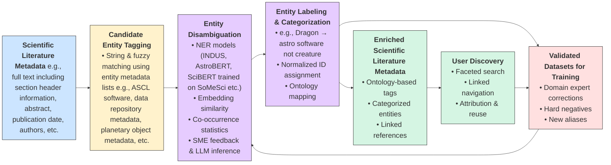

```mermaid
%%{ init: { "theme": "default", "themeVariables": { "fontSize": "25px" } } }%%
flowchart LR
    %% Input
    A[<b>Scientific Literature Metadata</b> e.g., full text including section header information, abstract, publication date, authors, etc.] --> B[<b>Candidate Entity Tagging</b><br/>• String & fuzzy matching using entity metadata lists e.g., ASCL software, data repository metadata, planetary object metadata, etc.<br/>]

    %% Disambiguation
    B --> C[<b>Entity Disambiguation</b><br/>• NER models #40;INDUS, AstroBERT, SciBERT trained on SoMeSci etc.#41;<br/>• Embedding similarity<br/>• Co-occurrence statistics<br/>• SME feedback & LLM inference]

    %% Labeling & Categorization
    C --> D[<b>Entity Labeling & Categorization</b><br/>• e.g., Dragon → astro software not creature<br/>• Normalized ID assignment<br/>• Ontology mapping]

    %% Feedback loop for model improvement
    D --> E[<b>Validated Datasets for Training</b><br/>• Domain expert corrections<br/>• Hard negatives<br/>• New aliases]
    E --> C

    %% Output
    D --> F[<b>Enriched Scientific Literature Metadata</b><br/>• Ontology-based tags<br/>• Categorized entities<br/>• Linked references]
    F --> G[<b>User Discovery</b><br/>• Faceted search<br/>• Linked navigation<br/>• Attribution & reuse]
    G --> E

    %% Styling
    classDef input fill:#cce5ff,stroke:#000;
    classDef tagging fill:#fff2cc,stroke:#000;
    classDef disambig fill:#e6ccff,stroke:#000;
    classDef train fill:#ffe0e0,stroke:#000;
    classDef output fill:#d5f5e3,stroke:#000;

    %% Assign classes
    class A input;
    class B tagging;
    class C,D disambig;
    class E train;
    class F,G output;
```